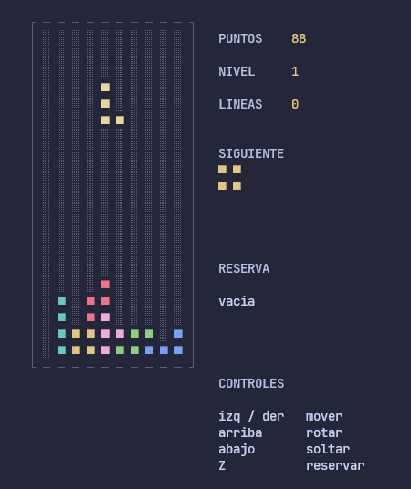

# TETRIS en C++

Un Tetris de consola hecho en C++ puro, sin librerías externas ni motores. El dibujo se
arma en un búfer de pantalla en memoria y una sola vez por cuadro se copia a la consola
de Windows con la API de Win32, por eso el juego no tiene ventana ni dependencias: se
compila y se juega.

Este repo nació de un Tetris a medio hacer. La estructura de clases se mantuvo tal
cual estaba (`Tabla` y `Bloque` como base, las siete piezas derivadas), pero la lógica
se reescribió completa: las colisiones se calculan con un solo chequeo, la rotación
usa traslación de matriz, y el `main` ahora maneja puntaje, niveles, reserva y
reinicio.

## Así se ve



## Qué tiene

- Las 7 piezas clásicas (I, O, T, S, Z, J, L) con su color.
- Rotación con "empujones" contra las paredes: si al girar la pieza no entra, se
  intenta empujarla un poco a los lados o hacia arriba antes de cancelar el giro.
- Reserva (una sola pieza guardada por turno).
- Previsualización de la siguiente pieza en el panel lateral.
- Puntaje: 100/300/500/800 por 1/2/3/4 líneas, multiplicado por el nivel, más 1 punto
  por fila recorrida al soltar la pieza.
- Niveles cada 10 líneas; la pieza cae cada vez más rápido.
- Salida de piezas con la regla de la bolsa (7 piezas barajadas por ciclo), para que no
  salgan cinco iguales seguidas.
- Sonidos de línea completada y de derrota con `Beep()` de Windows (sin archivos de audio
  en el repo) y que se pueden apagar con `M`.
- Game over y reinicio sin salir del programa.

## Requisitos

- Windows (el juego usa la API de consola de Windows).
- [MinGW-w64](https://www.mingw-w64.org/) con `g++`. Cualquier versión con soporte de
  C++17 sirve.
- Opcional: Visual Studio Code con la extensión C/C++ si preferís compilar y depurar
  desde el editor.

## Clonar el repo

```bash
git clone https://github.com/ricardo004g/TETRIS_Cpp.git
cd TETRIS_Cpp
```

## Compilar y jugar

Con MinGW desde la terminal, en la carpeta del proyecto:

```bash
g++ -std=c++17 Tetris.c++ -o Tetris.exe
Tetris.exe
```

Si `g++` no está en el PATH y lo instalaste en `C:\mingw64`, se puede llamar directo:

```bash
C:/mingw64/bin/g++.exe -std=c++17 Tetris.c++ -o Tetris.exe
C:/mingw64/bin/Tetris.exe
```

Con Visual Studio Code: abrí la carpeta, apretá `Ctrl+Shift+B` para compilar (la tarea
"compilar tetris" deja el ejecutable en `output/Tetris.exe`) y `F5` para correrlo con
el depurador.

Un detalle sobre la consola: el juego dibuja con los caracteres `█` y `░` en la
página de códigos 437, la clásica de las consolas de Windows. Si ves caracteres raros
en vez de los bloques, revisá que la consola esté en esa página de códigos y que la
ventana tenga al menos 50 columnas.

## Controles

| Tecla | Qué hace |
| --- | --- |
| ← → | Mover la pieza a los lados |
| ↑ | Rotar |
| ↓ | Soltar la pieza de golpe (1 punto por fila) |
| Z | Guardar la pieza en la reserva |
| M | Prender o apagar el sonido |
| Q / Esc | Salir |
| Enter | Reiniciar después de un game over |

## Cómo está armado el proyecto

| Archivo | Qué contiene |
| --- | --- |
| `Tetris.c++` | El `main`: bucle de juego, puntaje, niveles, panel, sonidos y game over. |
| `Tabla.h` | La matriz del tablero y la pantalla virtual donde se arma cada cuadro. |
| `Bloque.h` | Clase base de las piezas: posición, colisiones, rotación y dibujo. |
| `Bloques.h` | Las siete piezas concretas, cada una con su sprite y su color. |
| `texto.txt` | El logo en ASCII art. |

La idea es que `Bloque` no sabe qué pieza es: solo maneja un sprite de hasta 4x4 dentro
de una matriz y una posición en el tablero. Cada subclase carga su propio dibujo. Todas
las decisiones de "¿esto cabe?" pasan por `cabeEn(dx, dy)`, que es la única función que
mira las paredes, el piso y los bloques ya guardados. Por eso las rotaciones y los
desplazamientos se comportan igual para las siete piezas.

Sobre el dibujo: `Tabla.h` tiene una pantalla virtual (`Lienzo`) con el carácter y el
color de cada posición. `gotoxy()` y `setColor()` ya no mueven el cursor de la consola,
sino que apuntan dentro de esa pantalla, y `Lienzo::volcar()` la copia entera a la
consola una única vez por cuadro. Antes se escribía celda por celda con `printf`, que
era lo que se notaba lento y además dejaba restos del texto de pausa en pantalla.

Sobre el sonido: en `Tetris.c++` hay un `namespace Sonido` que usa la función `Beep()` de
Windows, con una lista de frecuencias y duraciones para cada efecto. No hay ni un `.wav`
en el repo ni hace falta linkear nada: `Beep()` ya está en `kernel32`. Cada sonido corre
en un hilo propio porque `Beep()` es bloqueante y si se llamara desde el hilo del juego
este se congelaría mientras suena.
